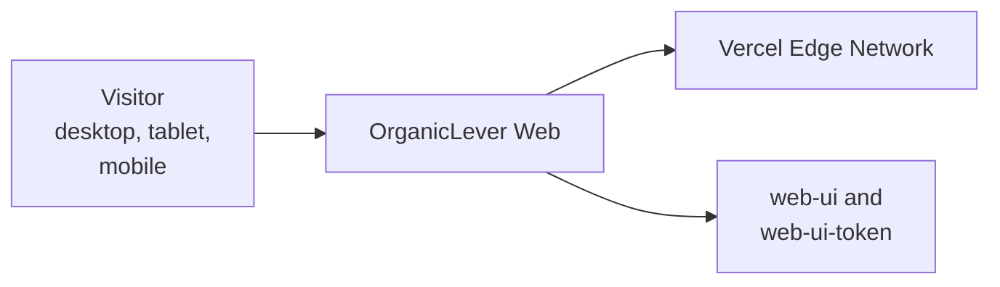

# OrganicLever Web — Architecture

The current, as-built system. A change that alters an actor, a container, a component
responsibility, a relationship, or a boundary updates this document in the same delivery unit.

## Scope

`organiclever-www` is the public marketing site served at the domain root. It carries the landing
content that used to live in the app's `landing` context. It has no local-first database, no
functional-effects runtime, and no state-machine library — deliberately, because it renders content
rather than tracking anything.

## System Context

The site is the entry point to the product: a visitor arrives here and leaves for the app. Nothing
is stored and nothing is submitted, so every route is static.

## Containers

| Container          | Technology                                      | Dev port |
| ------------------ | ----------------------------------------------- | -------- |
| `organiclever-www` | Next.js 16 App Router, React 19, Tailwind CSS 4 | 3200     |

## Components

Two flat feature contexts under `src/features/`:

| Feature context | Responsibility                                                        |
| --------------- | --------------------------------------------------------------------- |
| `home`          | hero, event-type features, the weekly-rhythm demo, principles, footer |
| `app-shell`     | shared layout primitives for the marketing surface                    |

Presentation comes from `@open-sharia-enterprise/web-ui` and `@open-sharia-enterprise/web-ui-token`,
so a visual change belongs to the design system rather than to this app unless it is genuinely
marketing-specific.

## Behaviour Perspectives

`behaviours/` splits by perspective rather than by deployable, because there is one deployable:

- `behaviours/frontend/` asserts what a visitor sees — the landing experience, accessibility, and
  environment-driven configuration.
- `behaviours/backend/` asserts the route-level behaviour of the Next.js server tier.

## Constraints

**No product state.** The site never reads or writes a journal. A feature that needs one belongs in
`organiclever-app-web`.

**Design system first.** Components come from the shared UI library. A one-off local component is a
signal the library is missing something, not a shortcut.

## Related

- [Behaviours](./behaviours/README.md) — the scenarios this system must satisfy.
- [`apps/organiclever-www/README.md`](../../../../apps/organiclever-www/README.md) — the implementing project.
