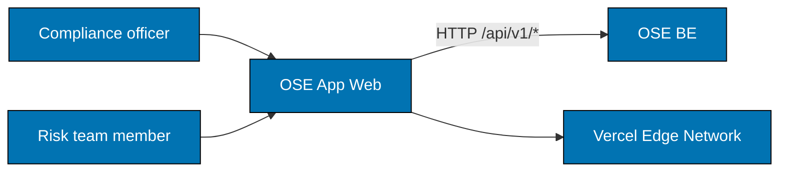

# OSE App Web — Architecture

The current, as-built system. A change that alters an actor, a container, a component
responsibility, a relationship, or a boundary updates this document in the same delivery unit.

## Scope

`ose-app-web` is the browser client for OSE's Sharia-compliance gap analysis. A compliance officer
loads a regulator's rule document and the organisation's internal policy, asks for a gap analysis,
and reads the resulting report. Every piece of durable state lives behind the API — the client holds
nothing a reload would need to recover.

## System Context

The client never reaches a language model directly. Every AI-assisted step is a call to `ose-be`,
which is what keeps the provider, the prompt, and the audit trail on one side of the boundary.

## Containers

| Container     | Technology                       | Dev port |
| ------------- | -------------------------------- | -------- |
| `ose-app-web` | Next.js 16, TypeScript, React 19 | 3300     |

## Components

Four bounded contexts under `src/contexts/`, each mirroring one on the backend:

| Bounded context     | Responsibility                                                      |
| ------------------- | ------------------------------------------------------------------- |
| `regulatory-source` | loading and browsing a regulator's rule document                    |
| `internal-policy`   | loading and browsing the organisation's own policy                  |
| `gap-analysis`      | requesting an analysis and rendering its report                     |
| `ai-orchestration`  | the client half of the AI-assisted flow: request state and progress |

A context owns its screens, its API calls, and its scenarios together. A change that spans two
contexts is a signal the boundary is wrong, not that the split is inconvenient.

## Constraints

**No direct model access.** The client holds no provider key and issues no request to an LLM. The
first exception would move the audit boundary and must be recorded here.

**Contexts mirror the backend.** Each client context has a counterpart in `ose-be`. Renaming one
without the other makes a report's provenance harder to follow than the rename is worth.

## Related

- [Behaviours](./behaviours/README.md) — the scenarios this system must satisfy.
- [`apps/ose-app-web/README.md`](../../../../apps/ose-app-web/README.md) — the implementing project.
