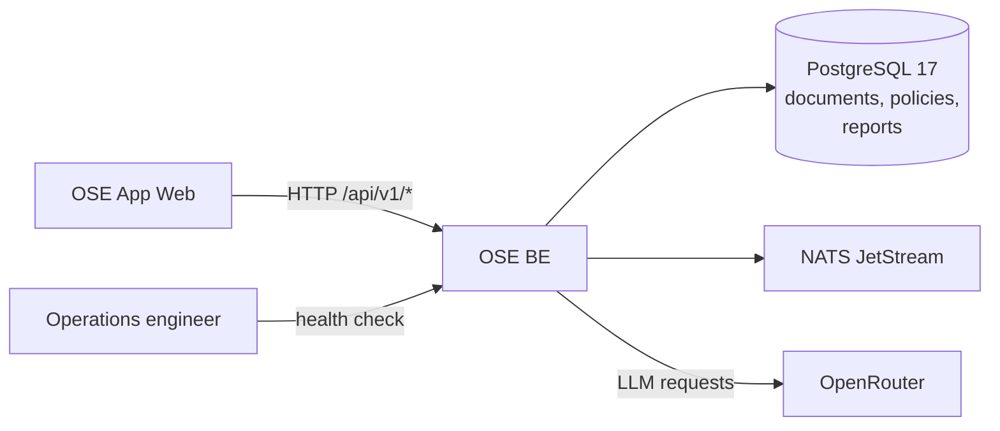

# OSE BE — Architecture

The current, as-built system. A change that alters an actor, a container, a component
responsibility, a relationship, or a boundary updates this document in the same delivery unit.

## Scope

`ose-be` ingests regulator rule documents and internal policies, runs an AI-assisted gap analysis
between them, and persists the resulting report. It is the only component that holds a model
provider credential and the only one that writes to the database.

## System Context

The service is where the audit trail lives: the document that was read, the prompt that was sent,
and the report that came back all persist on this side of the boundary.

## Containers

| Container | Technology              | Port | Persistence   |
| --------- | ----------------------- | ---- | ------------- |
| `ose-be`  | F#, Giraffe, ASP.NET 10 | 8302 | PostgreSQL 17 |

Schema changes ship as numbered SQL migrations under `db/migrations/`. NATS JetStream carries
asynchronous work; it is infrastructure the service depends on, not a container it owns.

## Components

Eight bounded contexts under `src/OseBe/Contexts/`:

| Bounded context    | Responsibility                                           |
| ------------------ | -------------------------------------------------------- |
| `RegulatorySource` | ingesting and serving a regulator's rule document        |
| `InternalPolicy`   | ingesting and serving the organisation's own policy      |
| `GapAnalysis`      | comparing the two and producing a report                 |
| `AiOrchestration`  | prompt construction, provider calls, and retry behaviour |
| `Messaging`        | NATS connection, configuration, and JetStream usage      |
| `Db`               | connection handling and migration application            |
| `Config`           | tiered environment loading                               |
| `Health`           | the readiness route operations depends on                |

Each context keeps its domain, its infrastructure, and its HTTP surface together, so a route's
persistence and its provider calls are readable in one place.

## Constraints

**The provider boundary is here.** `AiOrchestration` is the only context that talks to OpenRouter.
A second caller would split the audit trail and is an architectural change.

**Contract first.** The OpenAPI document under `contracts/` is the source; the service generates
from it. A handler whose response diverges fails the drift check.

**Migrations are forward-only and numbered.** A schema change adds a file under `db/migrations/`
rather than editing one that has already run somewhere.

## Related

- [Behaviours](./behaviours/README.md) — the scenarios this system must satisfy.
- [Contracts](./contracts/README.md) — the OpenAPI document this service generates from.
- [`apps/ose-be/README.md`](../../../../apps/ose-be/README.md) — the implementing project.
