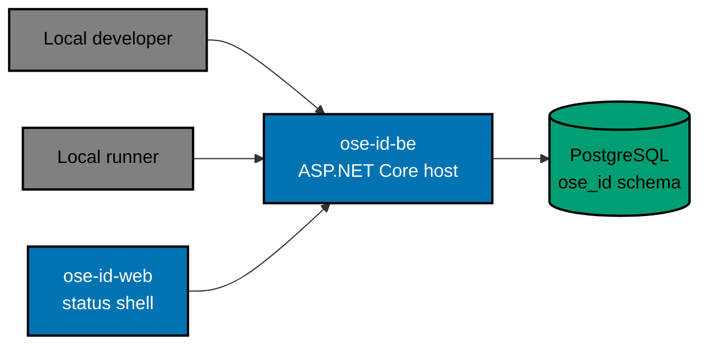

# OSE ID BE — Architecture

The current, as-built system. A change that alters an actor, a container, a component
responsibility, a relationship, or a boundary updates this document in the same delivery unit.

## Scope

`ose-id-be` is the executable boundary of OSE's identity provider, established before any credential
behaviour exists. It serves two health routes, answers five named identity routes with a disabled
capability, reads one migration-history table, and refuses to bind a listener in any runtime mode
other than Local or Test.

Account, token, company, and administration behaviour is deliberately absent, and so are GraphQL and
Model Context Protocol transports. That absence is a recorded decision rather than an oversight: the
seams that would carry those transports are described below and in the companion views, so a later
reader can tell an unmade decision from an unrecorded one.

## In This Architecture

- [Hexagonal dependency boundary](./architecture/hexagonal-dependency-boundary.md) — the rings, the
  inward-only dependency direction, the composition root, and the reserved future adapter seams.
- [Routes, configuration, and health](./architecture/routes-configuration-and-health.md) — the whole
  route inventory, the configuration surface, and the health-state model.

## System Context

Every actor reaches the service over loopback HTTP. Nothing sits in front of it: no gateway, no
session store, no external identity provider, no message bus, no model provider. The only thing
behind it is PostgreSQL, reached with a role that can read exactly one table.

## Containers

| Container   | Technology                          | Port | Persistence                                     |
| ----------- | ----------------------------------- | ---- | ----------------------------------------------- |
| `ose-id-be` | C# and ASP.NET Core, single process | 8501 | PostgreSQL `ose_id`, read-only at runtime       |
| PostgreSQL  | Owned local container               | 5438 | `ose_id.__EFMigrationsHistory` and nothing else |

Ports 8501 and 5438 are fixed reservations in
[`docs/reference/web-sites.md`](../../../../docs/reference/web-sites.md); a collision fails startup
before any resource is created, because two identity backends silently sharing a host port is the
failure this reservation exists to prevent.

The process is stateless. It holds no local database, key ring, session, upload, or migration lock,
and no security decision depends on a process cache — restarting an instance cannot lose, invent, or
change a result. Two instances of this container serve the same database and report the same schema
state, which is what makes routing affinity unnecessary.

## Components

The process is a modular monolith with a domain-centred dependency direction. Five logical rings
divide it, and every dependency between them points inward:

| Ring              | Owns                                                                  | Must not own                                      |
| ----------------- | --------------------------------------------------------------------- | ------------------------------------------------- |
| Domain            | Identity invariants, aggregates, value objects, lifecycle transitions | ASP.NET, EF Core, Npgsql, JSON, or HTTP types     |
| Application       | Use-case boundaries, outbound ports, transport-neutral results        | Routes, status codes, `DbContext`, or vendor DTOs |
| Inbound adapters  | The REST health handlers and the disabled-capability route table      | Business decisions or direct persistence          |
| Outbound adapters | SqlKata and Npgsql persistence, clock, and migration-time EF tooling  | Calling inbound adapters or redefining policy     |
| Host              | Configuration validation, registration, middleware order, lifecycle   | Service location from domain or application code  |

[The hexagonal dependency boundary](./architecture/hexagonal-dependency-boundary.md) draws those
rings, shows which adapters exist today, and marks the seams reserved for transports that do not.

## Persistence

Runtime data access is SqlKata compiled with `PostgresCompiler` and executed through
`SqlKata.Execution` over an explicit Npgsql connection and transaction. Entity Framework Core exists
only as migration-time tooling; the serving process registers no runtime `DbContext`, and change
tracking, `IQueryable`, EF Identity stores, and generic repositories are all absent by design.

Privilege is split. `ose_id_migrator` owns the schema and applies forward-only migrations in a
separate runner stage; `ose_id_app` — the only role the serving process is given — holds `USAGE` on
the schema and `SELECT` on the migration-history table, and holds no DDL, ownership, or policy-bypass
privilege at all. The application cannot alter the shape of the data it reads.

## Constraints

**Local and Test only.** The runtime mode is parsed and validated before the serving pipeline is
built. A missing, unknown, Staging, or Production mode exits non-zero with a sanitized diagnostic and
binds no listener. There is no bypass variable, and a test cannot make a non-local mode start.

**The route inventory is closed.** Two health routes and five disabled-capability routes are the
entire surface. No account, token, company, or administration route exists, and the negative
inventory is asserted rather than assumed.

**Nothing leaks in a diagnostic.** Health bodies are versioned and allowlisted, problem responses
carry only a status, a stable code, a title, and a correlation identifier. No exception, connection
string, database host, stack trace, or machine path is ever serialized.

**Future transports enter through the existing boundary or not at all.** A GraphQL or Model Context
Protocol adapter must call the same application ports and inherit the same authorization,
transaction, and audit behaviour. Reaching persistence or framework services directly is forbidden,
and neither transport is delivered here.

## Related

- [Behaviours](./behaviours/README.md) — the scenarios this system must satisfy.
- [OSE ID Web](../id-web/architecture.md) — the sibling corpus for the status shell that reads it.
