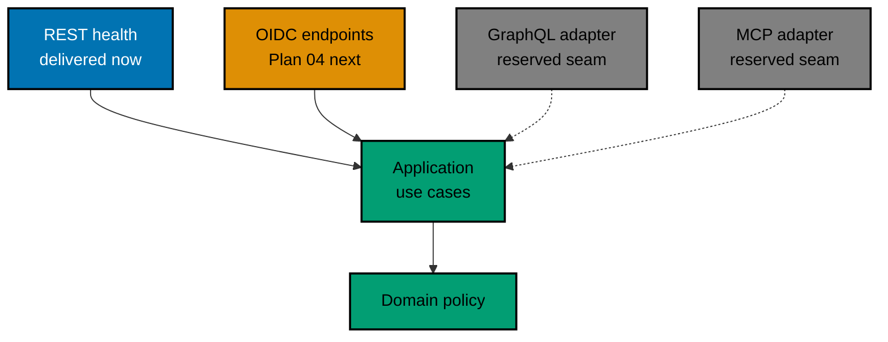
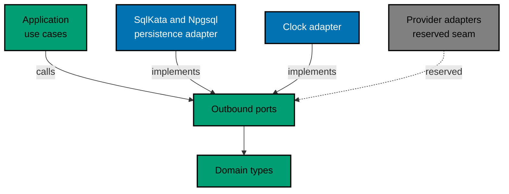
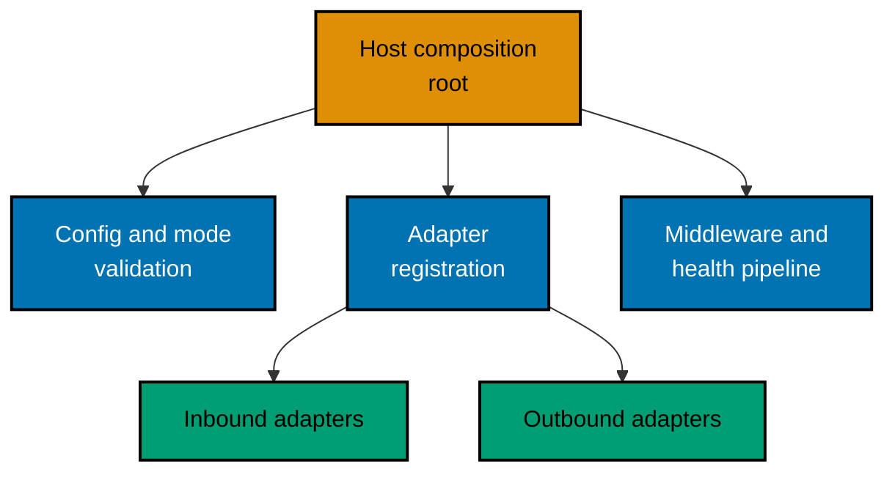

# OSE ID BE — Hexagonal Dependency Boundary

How the backend's rings depend on one another, which adapters exist today, and which seams are
reserved for transports that are not delivered. A change to a ring, an adapter, or an arrow updates
this document in the same delivery unit.

## The Rule Every Arrow Obeys

Every arrow in this document means _depends on_, and every arrow points inward. Inbound adapters
depend on the application boundary; outbound adapters depend on the ports the application declares;
the application depends on the domain. Nothing in the domain or the application depends on ASP.NET,
Npgsql, SqlKata, Entity Framework, or any transport type, so no arrow ever leaves the core.

That single rule is what keeps a second transport from becoming a second security path. Because an
adapter can only reach a use case, it cannot skip the authorization, tenancy, transaction,
idempotency, privacy, and audit behaviour that live behind the boundary.

## Inbound Adapters

| Adapter                | Status                | What it carries                                              |
| ---------------------- | --------------------- | ------------------------------------------------------------ |
| REST health            | Delivered in Plan 01  | Liveness, readiness, and the disabled-capability route table |
| OIDC and OAuth         | Planned next, Plan 04 | Framework-native authorization and token endpoints           |
| GraphQL                | Reserved, not built   | Nothing; no schema, runtime, resolver, or package exists     |
| Model Context Protocol | Reserved, not built   | Nothing; no server, tool, resource, prompt, or transport     |

Solid arrows are delivered or committed work. Dashed grey boxes are seams, not scope: no GraphQL or
Model Context Protocol code, dependency, or configuration exists in this repository, and a separately
authorized plan must pass its own API, security, privacy, testing, and operational gates before
either becomes real. Here, MCP means the Model Context Protocol, not the browser automation
connector some verification workflows refer to by the same initials.

Every inbound adapter follows the same sequence: validate protocol syntax and size at the edge,
derive a verified caller context from server-validated material rather than request fields, invoke
exactly one application command or query, and map the transport-neutral result back to its own
protocol. An unknown result fails closed.

## Outbound Adapters

The application declares the port and calls it; the adapter implements it. Both dependencies point at
the port, which is why replacing the persistence technology cannot reach a use case.

| Outbound adapter  | Status              | Boundary it must not cross                            |
| ----------------- | ------------------- | ----------------------------------------------------- |
| SqlKata, Npgsql   | Delivered           | Never exposes SQL, connections, or framework entities |
| Migration EF      | Tooling only        | Never registered in the serving process               |
| Clock             | Delivered           | Never lets a caller choose the time                   |
| Notification      | Reserved, not built | Nothing exists; a later plan supplies it              |
| Google federation | Reserved, not built | Nothing exists; a later plan supplies it              |
| Key storage       | Reserved, not built | Nothing exists; a later plan supplies it              |

An outbound adapter never calls an inbound adapter, never re-states a domain rule, and never returns
a vendor type across the port.

## Host and Composition Root

The composition root is the only component that names every concrete type. It validates the runtime
mode before the serving pipeline exists, registers each port against exactly one adapter, orders the
middleware, and owns process lifecycle and graceful shutdown. Domain and application code never
resolves a service from a container and never selects an implementation from caller input.

## Enforcement

The rings are separate assemblies, each an explicit project under `apps/ose-id-be/src/`:

| Logical ring       | Project                | Namespace root         | Outward dependency allowed                          |
| ------------------ | ---------------------- | ---------------------- | --------------------------------------------------- |
| Domain             | `OseId.Domain`         | `OseId.Domain`         | None — no `PackageReference`, no `ProjectReference` |
| Application        | `OseId.Application`    | `OseId.Application`    | `OseId.Domain` only                                 |
| Outbound adapters  | `OseId.Infrastructure` | `OseId.Infrastructure` | `OseId.Application` (implements its ports)          |
| Host / composition | `OseId.Host`           | `OseId.Host`           | `OseId.Application`, `OseId.Infrastructure`         |

The direction is proved rather than asserted: `apps/ose-id-be/tests/unit/Tests/ArchitectureBoundaryTests.cs`
fails the build when `OseId.Domain` or `OseId.Application` declares a `PackageReference`, or when
either assembly's compiled reference list names an ASP.NET Core, Entity Framework Core, Npgsql,
SqlKata, OpenIddict, GraphQL, or Model Context Protocol assembly. An outbound adapter referencing an
inbound one has no delivered example yet — `OseId.Infrastructure` has no `ProjectReference` back to
`OseId.Host`, and the project graph itself makes that direction a compile error, not a runtime check.

Empty projects, placeholder adapters, and speculative abstractions are not created to mirror a
diagram box. The reserved seams exist as the absence of an outward dependency, not as scaffolding.

## Related

- [OSE ID BE Architecture](../architecture.md) — the system this boundary belongs to.
- [Routes, configuration, and health](./routes-configuration-and-health.md) — what the delivered
  inbound adapter actually serves.
