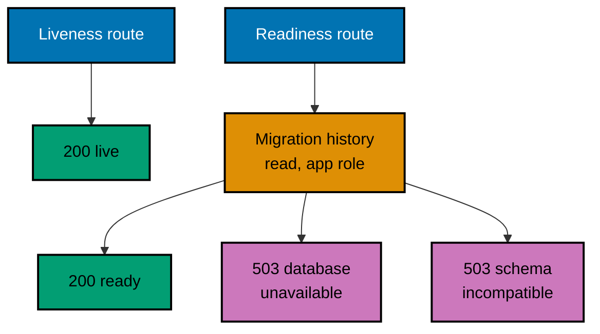

# OSE ID BE — Routes, Configuration, and Health

The whole route inventory, the whole configuration surface, and the health-state model the backend
reports. A new route, a new configuration value, or a new health code updates this document in the
same delivery unit.

## Route Inventory

This table is exhaustive. A route that is not listed here does not exist, and the absence is asserted
by test rather than assumed.

| Method | Path                         | Response                                   | Why it exists                            |
| ------ | ---------------------------- | ------------------------------------------ | ---------------------------------------- |
| `GET`  | `/health/live`               | `200` liveness body                        | Prove the host can process a request     |
| `GET`  | `/health/ready`              | `200` readiness body, or `503` with a code | Admit or refuse work from the runner     |
| `GET`  | `/connect/authorize`         | `404` `capability_disabled`                | OIDC authorization is not enabled        |
| `POST` | `/connect/token`             | `404` `capability_disabled`                | Token issuance is not enabled            |
| `GET`  | `/external/google/challenge` | `404` `capability_disabled`                | External provider sign-in is not enabled |
| `POST` | `/scim/v2/Users`             | `404` `capability_disabled`                | User provisioning is not enabled         |
| `GET`  | `/platform/admin/companies`  | `404` `capability_disabled`                | Platform administration is not enabled   |

No account, company, session, consent, or administration route exists. The five disabled rows are
matched as exact method and path pairs, so an unknown path still receives the framework's ordinary
`404` without a capability code — the distinction is what lets a test tell a deliberately disabled
capability from a route that was never registered. Enabling a capability later must update or remove
its own row and leave the others intact; it must never weaken the catch-all behaviour.

The disabled rows are a security inventory, not a feature flag. Nothing a browser, a header, or a
request body carries can turn one on.

## Configuration Surface

| Value                  | Purpose                         | Validation at startup                              |
| ---------------------- | ------------------------------- | -------------------------------------------------- |
| Runtime mode           | Selects Local or Test           | Only Local and Test parse; anything else exits     |
| `OSE_ID_BE_PORT`       | Loopback listener port, `8501`  | Must match the reservation and be free             |
| Application connection | PostgreSQL as `ose_id_app`      | Must be present; never logged or returned          |
| Migration credentials  | PostgreSQL as `ose_id_migrator` | Supplied only to the migration stage, not the host |

Validation runs before the serving pipeline is built, which is what makes every failure a startup
failure rather than an HTTP state. URLs must be absolute loopback origins; production-like origins
and modes are rejected; an unknown configuration key never silently chooses an insecure default; and
a port collision fails before any resource is created.

The runtime mode gate is a startup invariant, not a release flag. A missing, unknown, Staging, or
Production mode exits non-zero with the stable `runtime_mode_disabled` diagnostic and binds no
listener. No "allow insecure production" variable exists, and the guard stays until a separate
production-readiness plan supplies the infrastructure, threat review, and an explicit removal step.

Secrets never appear in a log line, a health body, a problem response, or recorded evidence.
Connection strings and passwords are redacted at every one of those surfaces.

## Health-State Model



| Route           | Depends on                            | Meaning of success               | Failure codes                                 |
| --------------- | ------------------------------------- | -------------------------------- | --------------------------------------------- |
| `/health/live`  | The host runtime only                 | The process can answer a request | None; an absent process has no HTTP response  |
| `/health/ready` | Configuration, PostgreSQL, and schema | The host may receive work        | `database_unavailable`, `schema_incompatible` |

Liveness never touches PostgreSQL. That separation is the whole point of having two routes: when the
database stops, liveness must stay successful while readiness turns unsuccessful, so a runner can
tell a dependency outage from a dead process and restart nothing.

Readiness compares the applied, active migration identifiers against the compatible set the running
code was built with. A database newer or older than that range reports `schema_incompatible` with a
stable code rather than a message. The check reads; it never writes a readiness row, and it never
triggers a migration.

The body is versioned and allowlisted:

```json
{
  "schemaVersion": 1,
  "status": "ready",
  "components": [{ "name": "postgresql", "code": "ready" }],
  "correlationId": "opaque-value"
}
```

Exceptions and arbitrary framework health data are never serialized. HTTP status plus `status`
carries the outcome; component codes are stable enough for a runner to diagnose with, and are
explicitly not a production service-level promise.

## Related

- [OSE ID BE Architecture](../architecture.md) — the system these routes belong to.
- [Hexagonal dependency boundary](./hexagonal-dependency-boundary.md) — the adapter that serves them.
