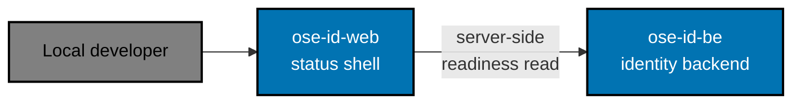
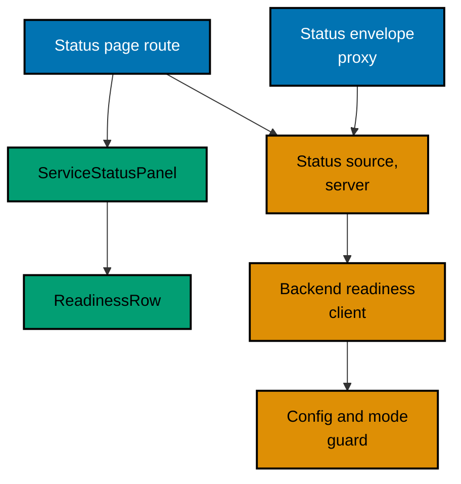

# OSE ID Web — Architecture

The current, as-built system. A change that alters an actor, a container, a component
responsibility, a relationship, or a boundary updates this document in the same delivery unit.

## Scope

`ose-id-web` is a deliberately inert status shell. It renders one local page that reports its own
liveness, reads `ose-id-be`'s readiness from the server and states what that backend says about
itself and its database and schema, and says plainly that identity features are disabled. It is not
a sign-in surface and holds nothing that a sign-in surface would need.

There is no sign-in form, no browser token store, no identity cookie, no session, and no
backend-for-frontend protocol behaviour. Those absences are the design: a shell that cannot
authenticate anyone cannot leak a credential while the real identity work is still being built.

## In This Architecture

- [Runtime guard and status reporting](./architecture/runtime-guard-and-status-reporting.md) — the
  startup mode guard, how the shell obtains a status, and what it is allowed to show.

## System Context

The browser talks only to `ose-id-web`. The readiness read happens inside the server render, so the
browser never issues it and never learns the backend origin. The shell is not a health proxy: it
exposes no health route of its own, forwards no backend body, and mirrors no backend status code
onto an API surface.

## Containers

| Container    | Technology             | Port | Persistence |
| ------------ | ---------------------- | ---- | ----------- |
| `ose-id-web` | Next.js and TypeScript | 3500 | none        |

Port 3500 is a fixed reservation in
[`docs/reference/web-sites.md`](../../../../docs/reference/web-sites.md). The process is stateless in
the same sense the backend is: it stores nothing on disk, keeps no session, and holds no value whose
loss on restart would change what a reader is told.

## Components

| Component                | Responsibility                                                                                             |
| ------------------------ | ---------------------------------------------------------------------------------------------------------- |
| Status page route        | Serving the one page at `/` and nothing else                                                               |
| Status envelope proxy    | Choosing `200` or the sanitized `503` for that one path, which a page cannot choose for itself             |
| `ServiceStatusPanel`     | Naming the status region and composing its rows                                                            |
| `ReadinessRow`           | Presenting one component's state as text, never as colour alone                                            |
| Status source            | Turning the backend's answer into the five-row report (shell, backend, PostgreSQL, schema, authentication) |
| Backend readiness client | Reading `GET /health/ready` server-side and collapsing it to a closed set of states                        |
| Config and mode guard    | Refusing to start outside Local and Test, and refusing a non-loopback backend origin                       |

`ServiceStatusPanel` and `ReadinessRow` stay local to this app. They reuse the shared `Card`,
`Alert`, `Badge`, and token primitives from `libs/web-ui`, and are promoted to a shared library only
when a second real consumer exists — a component with one caller is a guess about the second.

## Constraints

**Status is text.** Every component state is readable as words, so a screen reader and a
monochrome display convey the same thing a colour does. The status region is named and announces
politely on refresh without stealing focus.

**No identity surface.** The page renders no form, no provider link, no company control, and no
session cookie. A control that could start an authentication flow does not belong here until a plan
that owns authentication adds it.

**Nothing infrastructural is shown.** The one external read this shell makes collapses to a closed
set of three named states before anything else sees it, so no backend host, connection detail,
problem title, correlation value, exception, machine path, or secret can reach a reader — including
through a failure, which produces a sanitized page rather than an exception.

**The shell's availability is its own.** A reader can tell "the shell is down" from "the shell is up
and the backend is not", which a proxy would collapse into one failure.

**Local and Test only.** The same startup invariant the backend applies applies here, enforced
independently in this process rather than inherited from the backend's answer.

## Related

- [Behaviours](./behaviours/README.md) — the scenarios this shell must satisfy.
- [OSE ID BE](../id-be/architecture.md) — the sibling backend corpus whose readiness this shell
  reads.
