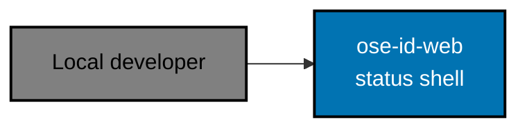
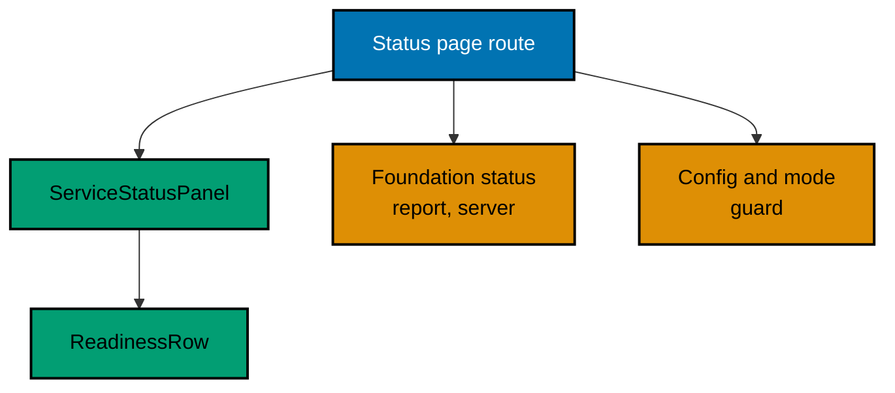

# OSE ID Web — Architecture

The current, as-built system. A change that alters an actor, a container, a component
responsibility, a relationship, or a boundary updates this document in the same delivery unit.

## Scope

`ose-id-web` is a deliberately inert status shell. It renders one local page that reports its own
liveness, states in words that backend readiness is not reported in this foundation slice, and says
plainly that identity features are disabled. It is not a sign-in surface and holds nothing that a
sign-in surface would need.

There is no sign-in form, no browser token store, no identity cookie, no session, and no
backend-for-frontend protocol behaviour. Those absences are the design: a shell that cannot
authenticate anyone cannot leak a credential while the real identity work is still being built.

## In This Architecture

- [Runtime guard and status reporting](./architecture/runtime-guard-and-status-reporting.md) — the
  startup mode guard, how the shell obtains a status, and what it is allowed to show.

## System Context

The browser talks only to `ose-id-web`. In this foundation slice the shell makes no outbound
connection to `ose-id-be` at all — it reports its own liveness and states, in words, that backend
readiness is not reported yet (see "Not Yet Implemented: The Backend Read" in Runtime guard and
status reporting, listed above, for the deferred design).

## Containers

| Container    | Technology             | Port | Persistence |
| ------------ | ---------------------- | ---- | ----------- |
| `ose-id-web` | Next.js and TypeScript | 3500 | none        |

Port 3500 is a fixed reservation in
[`docs/reference/web-sites.md`](../../../../docs/reference/web-sites.md). The process is stateless in
the same sense the backend is: it stores nothing on disk, keeps no session, and holds no value whose
loss on restart would change what a reader is told.

## Components

| Component                | Responsibility                                                                                                                                                |
| ------------------------ | ------------------------------------------------------------------------------------------------------------------------------------------------------------- |
| Status page route        | Serving the one page at `/` and nothing else                                                                                                                  |
| `ServiceStatusPanel`     | Naming the status region and composing its rows                                                                                                               |
| `ReadinessRow`           | Presenting one component's state as text, never as colour alone                                                                                               |
| Foundation status report | Returning a fixed three-row report (shell, backend, authentication) — reads nothing outside the process; see Runtime guard and status reporting, listed above |
| Config and mode guard    | Refusing to start outside Local and Test                                                                                                                      |

`ServiceStatusPanel` and `ReadinessRow` stay local to this app. They reuse the shared `Card`,
`Alert`, `Badge`, and token primitives from `libs/web-ui`, and are promoted to a shared library only
when a second real consumer exists — a component with one caller is a guess about the second.

## Constraints

**Status is text.** Every component state is readable as words, so a screen reader and a
monochrome display convey the same thing a colour does. The status region is named and announces
politely on refresh without stealing focus.

**No identity surface.** The page renders no form, no provider link, no company control, and no
session cookie. A control that could start an authentication flow does not belong here until a plan
that owns authentication adds it.

**Nothing infrastructural is shown.** Today this slice reads nothing outside the process, so the only
reachable failure is the framework's own unhandled-render path, which is already a bare, generic
page — never a stack trace, a backend host, a connection detail, a machine path, or a secret. The
same guarantee is required to hold once a real external read is added (see "Not Yet Implemented:
The Backend Read" in Runtime guard and status reporting, listed above): a failed read must produce a
sanitized page, not an exception.

**Local and Test only.** The same startup invariant the backend applies applies here, enforced
independently in this process rather than inherited from the backend's answer.

## Related

- [Behaviours](./behaviours/README.md) — the scenarios this shell must satisfy.
- [OSE ID BE](../id-be/architecture.md) — the sibling backend corpus; this shell does not yet read
  its readiness (see the deferred design linked above).
