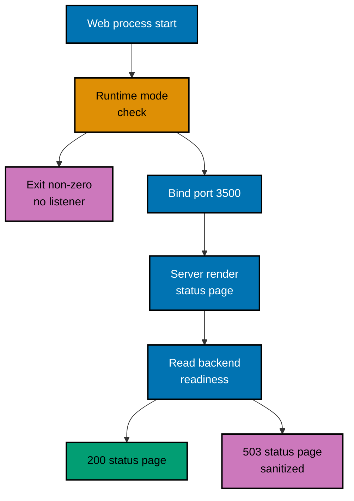

# OSE ID Web — Runtime Guard and Status Reporting

How the status shell decides it is allowed to run, how it obtains something to report, and what it is
allowed to show. A change to the guard, the read, or the sanitization rule updates this document in
the same delivery unit.

## Startup Guard

The shell enforces its own runtime-mode invariant. It parses and validates the mode before binding a
listener, permits only Local and Test, and exits non-zero with the stable `runtime_mode_disabled`
diagnostic for a missing, unknown, Staging, or Production mode.

This guard is independent of the backend's. `ose-id-web` does not ask `ose-id-be` whether it may
start, and a running backend does not authorize a web process in a mode the web process rejects.
Two processes that fail closed separately cannot be talked into opening by one of them.

Configuration validated at startup is the runtime mode, the listener port `OSE_ID_WEB_PORT=3500`,
and the backend base URL `http://127.0.0.1:8501`. A non-loopback or production-like origin is
rejected, and a port collision fails before the listener exists.

## Request Path

## What the Shell Reports

The shell reports a rendered judgement about the backend, not the backend's own answer. Three facts
follow from that, and they are easy to confuse:

- The read happens **on the server**, inside the Next.js request, using the configured backend base
  URL. The browser never issues it and never learns the backend origin.
- The shell is **not a health proxy**. It exposes no health route of its own, forwards no backend
  response body, and mirrors no backend status code onto an API surface. Nothing downstream may treat
  `ose-id-web` as a place to probe `ose-id-be`.
- The shell's **own availability is its own**. That the page answered at all is the web process's
  liveness signal; the rows inside it describe the backend. A reader can therefore tell "the shell is
  down" from "the shell is up and the backend is not", which a proxy would collapse into one failure.

| Displayed row | Source                                        | Failure presentation             |
| ------------- | --------------------------------------------- | -------------------------------- |
| Backend       | Whether the readiness read succeeded at all   | Stated as unavailable, in words  |
| PostgreSQL    | The database component code in that readiness | Stated as unavailable, in words  |
| Schema        | The schema component code in that readiness   | Stated as incompatible, in words |

When the backend cannot be read, the page still renders: it returns a sanitized `503` status page
that names the unavailable component beside the healthy ones. An unhandled render failure returns the
framework's sanitized `500`. Neither ever contains a stack trace, a backend host, a machine path, a
cookie, or an identity field.

Because the shell holds no state between requests, a refresh re-reads rather than replays. There is
nothing cached whose staleness could tell a reader the system is healthy when it is not.

## Related

- [OSE ID Web Architecture](../architecture.md) — the system this behaviour belongs to.
- [OSE ID BE routes, configuration, and health](../../id-be/architecture/routes-configuration-and-health.md) —
  the readiness contract this shell reads.
