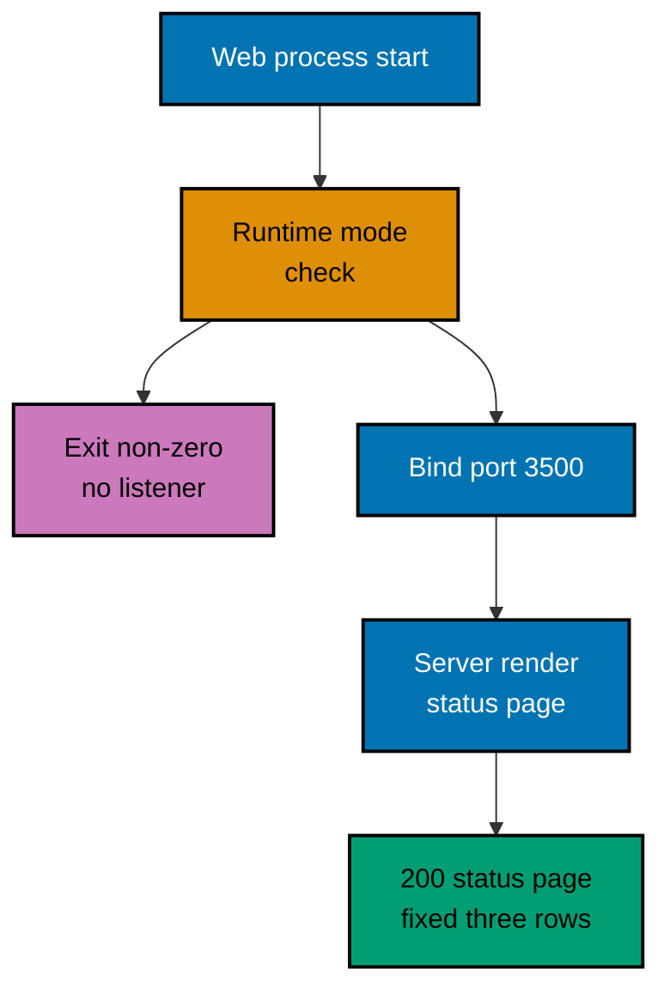

# OSE ID Web — Runtime Guard and Status Reporting

How the status shell decides it is allowed to run, how it obtains something to report, and what it is
allowed to show. A change to the guard, the read, or the sanitization rule updates this document in
the same delivery unit.

## Startup Guard

The shell enforces its own runtime-mode invariant. It parses and validates the mode before binding a
listener, permits only Local and Test, and exits non-zero with the stable `runtime_mode_disabled`
diagnostic for a missing, unknown, Staging, or Production mode.

This guard is independent of the backend's. `ose-id-web` does not ask `ose-id-be` whether it may
start, and a running backend does not authorize a web process in a mode the web process rejects.
Two processes that fail closed separately cannot be talked into opening by one of them.

Configuration validated at startup is the runtime mode and the listener port
`OSE_ID_WEB_PORT=3500`. A port collision fails before the listener exists. This foundation slice
validates no backend base URL — it makes no outbound connection to `ose-id-be` at all (see
[Not Yet Implemented](#not-yet-implemented-the-backend-read) below).

## Request Path

## What the Shell Reports

In this foundation slice the shell reports a fixed, constant judgement — not a live read of anything
external. It always answers `200` with the same three rows:

| Displayed row    | Source                            | Stated value, always                                                    |
| ---------------- | --------------------------------- | ----------------------------------------------------------------------- |
| OSE ID web shell | That this request is being served | "Running" — the page answering is itself the liveness signal            |
| OSE ID backend   | Nothing; no backend call is made  | "Not reported" — true today, not a claim about actual backend readiness |
| Authentication   | A fixed constant                  | "Disabled" — the authentication-not-enabled notice                      |

Because the read is a constant, not an external call, there is no unreadable outcome today and the
`503` envelope `statusResponseEnvelope()` defines is unreachable in this slice — it exists ahead of
the source that will need it (see [Not Yet Implemented](#not-yet-implemented-the-backend-read)
below). The one reachable failure is the framework's own unhandled-render path, a generic, sanitized
`500` free of any stack trace, backend host, machine path, cookie, or identity field.

Because the shell holds no state between requests, a refresh re-reads rather than replays. There is
nothing cached whose staleness could tell a reader the system is healthy when it is not — this holds
today for the same reason it will hold once a real read replaces the constant: nothing is ever
cached.

## Not Yet Implemented: The Backend Read

The design below is the intended next slice, not current behaviour. Nothing in this section is
"as-built"; it exists so the eventual change lands against a recorded design instead of none. **A
change that implements any part of this must move it out of this section and into the sections
above, in the same delivery unit that ships the code** (per this document's own opening rule).

- The read will happen **on the server**, inside the Next.js request, using a configured backend base
  URL. The browser will never issue it and will never learn the backend origin.
- The shell will remain **not a health proxy**: it will expose no health route of its own, forward no
  backend response body, and mirror no backend status code onto an API surface. Nothing downstream
  may treat `ose-id-web` as a place to probe `ose-id-be`.
- The shell's **own availability will remain its own**, distinct from the backend's. A reader will be
  able to tell "the shell is down" from "the shell is up and the backend is not", which a proxy would
  collapse into one failure.
- The report will grow distinct `Backend`, `PostgreSQL`, and `Schema` rows, each stated as
  unavailable/incompatible in words on failure, and an unreadable result will return the already-built
  `sanitizedUnavailableDocument()` as a `503`, never an exception.

## Related

- [OSE ID Web Architecture](../architecture.md) — the system this behaviour belongs to.
- [OSE ID BE routes, configuration, and health](../../id-be/architecture/routes-configuration-and-health.md) —
  the readiness contract a future slice will read (see
  [Not Yet Implemented](#not-yet-implemented-the-backend-read) above).
