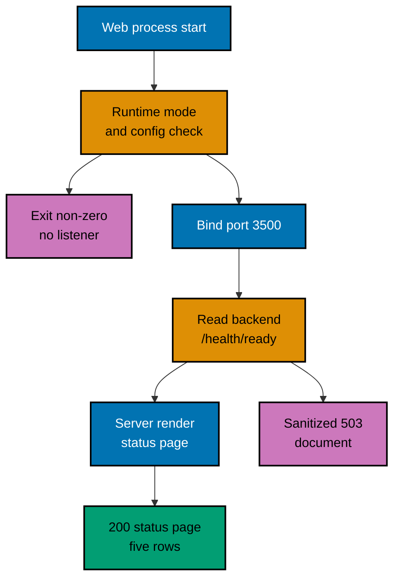

# OSE ID Web — Runtime Guard and Status Reporting

How the status shell decides it is allowed to run, how it obtains something to report, and what it is
allowed to show. A change to the guard, the read, or the sanitization rule updates this document in
the same delivery unit.

## Startup Guard

The shell enforces its own runtime-mode invariant. It parses and validates the mode before binding a
listener, permits only Local and Test, and exits non-zero with the stable `runtime_mode_disabled`
diagnostic for a missing, unknown, Staging, or Production mode.

This guard is independent of the backend's. `ose-id-web` does not ask `ose-id-be` whether it may
start, and a running backend does not authorize a web process in a mode the web process rejects.
Two processes that fail closed separately cannot be talked into opening by one of them.

Configuration validated at startup is the runtime mode, the listener port `OSE_ID_WEB_PORT=3500`,
and the backend origin `OSE_ID_BE_URL`, which defaults to the registered local
`http://127.0.0.1:8501`. A port collision fails before the listener exists. The backend origin must
be an absolute loopback origin: this shell serves in Local and Test only, so anything else is a
misconfiguration, and refusing it is what stops a local page from reading — and then reporting on —
somebody's real environment. The value is server-only and is never sent to the browser.

## Request Path

## The Backend Read

The read happens **on the server**, inside the request, against the configured backend origin. The
browser never issues it and never learns that origin.

The shell is **not a health proxy**. It exposes no health route of its own, forwards no backend
response body, and mirrors no backend status code onto an API surface. Nothing downstream may treat
`ose-id-web` as a place to probe `ose-id-be`.

The adapter reads `GET /health/ready` with `no-store` and a short timeout, and collapses whatever
comes back into one of four values before anything else in the process sees it:

| Backend answer                                | Shell's reading      |
| --------------------------------------------- | -------------------- |
| `200` with the exact published ready body     | ready                |
| `503` problem carrying `database_unavailable` | database unavailable |
| `503` problem carrying `schema_incompatible`  | schema incompatible  |
| anything else, including no answer at all     | unreadable           |

"Anything else" is deliberately wide: an unexpected status, a body of the wrong shape, an unreviewed
problem code, a non-JSON body, a refused connection, a dropped connection, or a timeout. The adapter
never throws and never logs, and its `catch` binds no error, because an error object is exactly the
value this surface may not see. A title, a correlation value, and every other field of the problem
body are read past rather than stored, so no free text can travel further than the adapter.

## What the Shell Reports

Five rows. The first and the last are the shell's own; the middle three are the backend's answer,
stated in words.

| Displayed row    | Source                            | Stated value                                                 |
| ---------------- | --------------------------------- | ------------------------------------------------------------ |
| OSE ID web shell | That this request is being served | "Running" — the page answering is itself the liveness signal |
| OSE ID backend   | The readiness read                | "Ready", "Not ready", or "Not reported"                      |
| PostgreSQL       | The readiness read                | "Ready", "Unavailable", or "Not reported"                    |
| Schema           | The readiness read                | "Compatible", "Incompatible", or "Not reported"              |
| Authentication   | A fixed constant                  | "Disabled" — the authentication-not-enabled notice           |

"Not reported" is never a guess dressed as an answer. A `schema_incompatible` reply proves the
database was reachable, but the backend did not _say_ so in that reply, so the PostgreSQL row says
it was not reported rather than inferring "Ready" — and the same in the other direction for a
`database_unavailable` reply.

The shell's own availability stays distinct from the backend's. A reader can tell "the shell is
down" from "the shell is up and the backend is not", which a proxy would collapse into one failure.

## The Two Outcomes, and the Two Reads

An App Router page cannot choose its own response status, so the envelope belongs to the proxy that
matches `/` and the rows belong to the page. Each performs the readiness read itself, and both run
inside the same request.

- **Readable** — `200 text/html; charset=utf-8`, `Cache-Control: no-cache`, no cookie, the five rows
  above.
- **Unreadable** — the sanitized `503` document: a constant page, styled inline so it does not
  depend on a stylesheet request succeeding, carrying the same `role="status"` semantics as the
  rendered region, and assembled entirely from literals so no machine detail can reach a reader.

Two reads per request is a deliberate cost: one extra loopback request on a page with no other
traffic, in exchange for neither stage serving a state the other invented. The two can disagree only
if the backend changes between them, and the only visible direction of that disagreement — the
envelope read succeeding and the page read failing — renders "Not reported", never a guess.

Because the shell holds no state between requests, a reload re-reads rather than replays. There is
no refresh control and no retry state: reloading the page _is_ the "check again" gesture, and adding
a control would imply this page holds something between requests. Nothing is cached, so no staleness
can tell a reader the system is healthy when it is not.

## Related

- [OSE ID Web Architecture](../architecture.md) — the system this behaviour belongs to.
- [OSE ID BE routes, configuration, and health](../../id-be/architecture/routes-configuration-and-health.md) —
  the readiness contract this shell reads.
