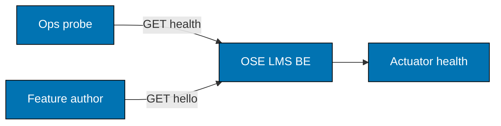
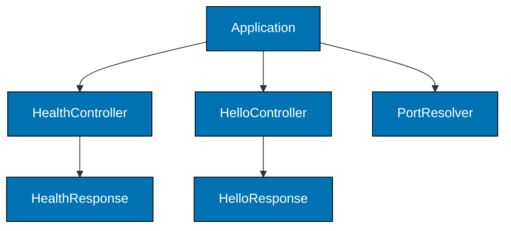

# OSE LMS BE — Architecture

The current, as-built system. A change that alters an actor, a container, a component
responsibility, a relationship, or a boundary updates this document in the same delivery unit.

## Scope

`ose-lms-be` answers two routes and reports its own health. It holds no domain model, no database,
and no credential. Its architectural purpose is to be correct and already gated, so that the first
real LMS feature is added to a project that already builds, formats, tests, and ships.

What is deliberately absent is part of the design and is listed under Constraints, so a later
reader can tell an unmade decision from an unrecorded one.

## System Context

Both actors reach the service over plain HTTP on a single port. Nothing sits behind it yet: no
datastore, no message bus, no model provider. Every response is computed in-process from a
constant.

## Containers

| Container    | Technology                   | Port | Persistence |
| ------------ | ---------------------------- | ---- | ----------- |
| `ose-lms-be` | Java 25, Spring Boot, Gradle | 8303 | none        |

Port 8303 is the default. `OSE_LMS_BE_PORT` overrides it, and a value that is not a port fails at
startup rather than falling back — two backends silently contending for one host port is the
failure this rule exists to prevent.

## Components

| Component          | Responsibility                                              |
| ------------------ | ----------------------------------------------------------- |
| `HealthController` | serving the liveness route operations depends on            |
| `HelloController`  | serving the greeting route a feature author copies          |
| `PortResolver`     | resolving the listener port and rejecting a malformed value |
| Contract models    | generated from the OpenAPI document, not hand-written       |

`PortResolver` takes the environment value as a parameter rather than reading the environment
itself. That is what makes it provable in-process, without starting a server.

## Constraints

**Contract first.** The OpenAPI document under `contracts/` is the source; the controllers return
generated models rather than inline maps. A handler whose response diverges from the schema is a
defect, not a variation.

**Actuator exposes health and nothing else.** Exposure is asserted by configuration rather than by
enumerating endpoints, so the assertion stays true as Spring Boot's endpoint set changes.

**No Integration layer.** The service owns no local resource boundary — no database, no broker, no
filesystem contract — so an Integration adapter would have nothing to prove that Unit does not
already prove. The layer is inapplicable, not skipped.

## Related

- [Behaviours](./behaviours/README.md) — the scenarios this system must satisfy.
- [Contracts](./contracts/README.md) — the OpenAPI document this service generates from.
- [`apps/ose-lms-be/README.md`](../../../../apps/ose-lms-be/README.md) — the implementing project.
