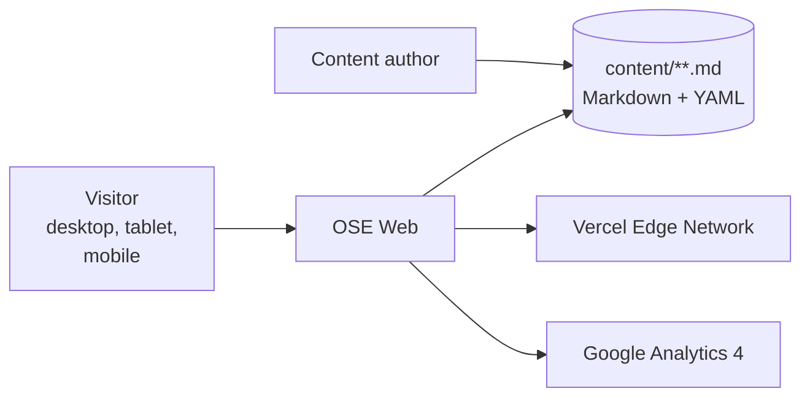

# OSE Web — Architecture

The current, as-built system. A change that alters an actor, a container, a component
responsibility, a relationship, or a boundary updates this document in the same delivery unit.

## Scope

`ose-www` is the OSE platform's public site: the landing page, the updates written as Markdown, the
search over them, and the RSS feed. There is no account and nothing is submitted, so every route can
be generated ahead of a request.

## System Context

A content author's only interface is a Markdown file with YAML frontmatter, so an authoring mistake
surfaces as a build failure rather than a broken page in production.

## Containers

`ose-www` deploys as a **single** container named `web`. The tRPC API runs inside the same Next.js
process; there is no separate backend deployable.

| Container | Technology                       | Responsibility                                    |
| --------- | -------------------------------- | ------------------------------------------------- |
| `web`     | Next.js 16 App Router + tRPC v11 | pages, static generation, the in-process tRPC API |

Two derived stores sit inside the boundary and neither is a database: the content directory is the
repository's own Markdown tree, and the search index is an in-memory FlexSearch index built from it.

## Components

Seven feature contexts under `src/features/`:

| Feature context | Responsibility                                         |
| --------------- | ------------------------------------------------------ |
| `landing`       | the marketing entry point                              |
| `content`       | Markdown pipeline, rendering, and code-block behaviour |
| `search`        | the search index and the search UI                     |
| `rss-feed`      | the feed built from published updates                  |
| `seo`           | metadata and the sitemap                               |
| `app-shell`     | navigation, theme, responsive layout, accessibility    |
| `health`        | the readiness route                                    |

## Behaviour Perspectives

`behaviours/` splits by perspective rather than by deployable, because there is one deployable:

- `behaviours/frontend/` asserts what a visitor sees in the DOM.
- `behaviours/backend/` asserts what the in-process API returns over HTTP.

## Constraints

**Static generation is the default.** Every content route is generated at build time. A feature that
needs per-request rendering changes the deployment's cost and cache behaviour.

**Content is a build input.** Markdown and its frontmatter are read at build time, not fetched. A
page that needs live data belongs in `ose-app-web`.

**Accessibility is asserted, not reviewed.** WCAG AA behaviour is covered by scenarios.

## Related

- [Behaviours](./behaviours/README.md) — the scenarios this system must satisfy.
- [`apps/ose-www/README.md`](../../../../apps/ose-www/README.md) — the implementing project.
