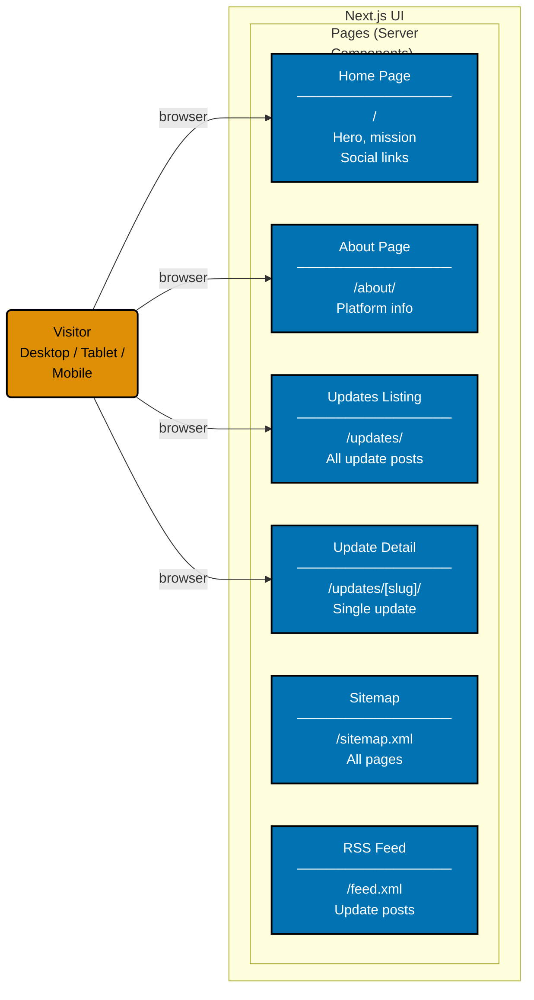
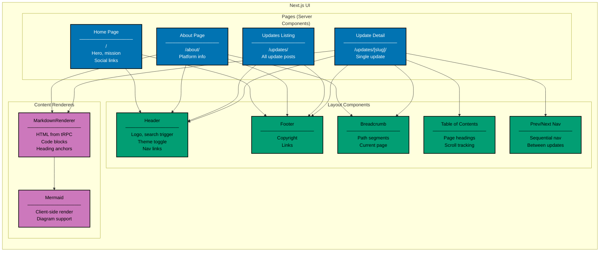
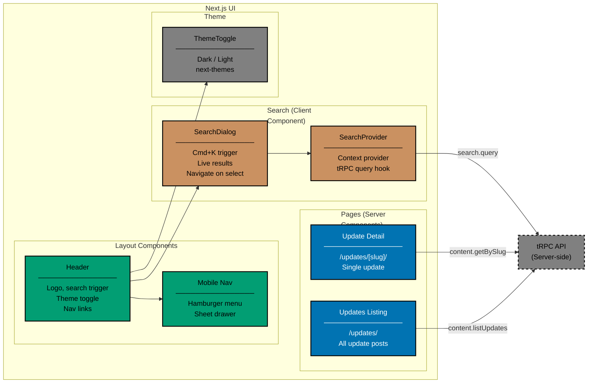

# Component Diagram: UI (Frontend)

Level 3 of the C4 model. Shows the logical components inside the Next.js client-side application:
pages, layout components, content renderers, search, and theme.

Pages are Server Components by default. Client Components are used only where browser interactivity
is needed (search dialog, theme toggle, mobile navigation, Mermaid rendering). There is no i18n
layer — the site is English only.

The component graph is presented as three views of the same architecture, one per hop: entry
(visitor to pages), composition (pages to layout and renderers), and integration (header to search,
theme, mobile nav, and the tRPC API).

## View 1 — Visitor to Pages

A visitor reaches four navigable routes. Two further routes (`/sitemap.xml`, `/feed.xml`) are
machine-facing and are not entered through the browser navigation.

## View 2 — Pages to Layout Components and Content Renderers

Each page composes layout components, and the two markdown-backed pages additionally drive the
content renderers.

## View 3 — Header, Search, Theme, and the tRPC API

The header mounts the three client-interactive pieces, and both the search provider and the two
content-backed pages call the server-side tRPC API.

## Gherkin Coverage by Component

Each component above is exercised by Gherkin features from
[specs/apps/ose/www/behaviours/frontend/`](./behaviours/frontend/):

| Component                      | Gherkin Domain | Scope                                  |
| ------------------------------ | -------------- | -------------------------------------- |
| Home Page (hero, social icons) | landing-page   | Hero rendering, social links           |
| Header + navigation links      | navigation     | Header links, external links           |
| Breadcrumb + Prev/Next         | navigation     | Breadcrumbs, sequential navigation     |
| ThemeToggle                    | theme          | Default theme, toggle dark/light       |
| Header + Mobile Nav            | responsive     | Hamburger menu, desktop nav visibility |

## Testing

| Level       | What                           | Coverage     |
| ----------- | ------------------------------ | ------------ |
| `test:unit` | Component rendering via Vitest | >= 99% lines |
| `test:e2e`  | Full browser via Playwright    | N/A          |

## Related

- **Architecture**: [architecture.md](./architecture.md)
- **api perspective components**: [api-components.md](./api-components.md)
- **web perspective scenarios**: [behaviours/frontend/](./behaviours/frontend/README.md)
- **Parent**: [ose-www specs](./README.md)
