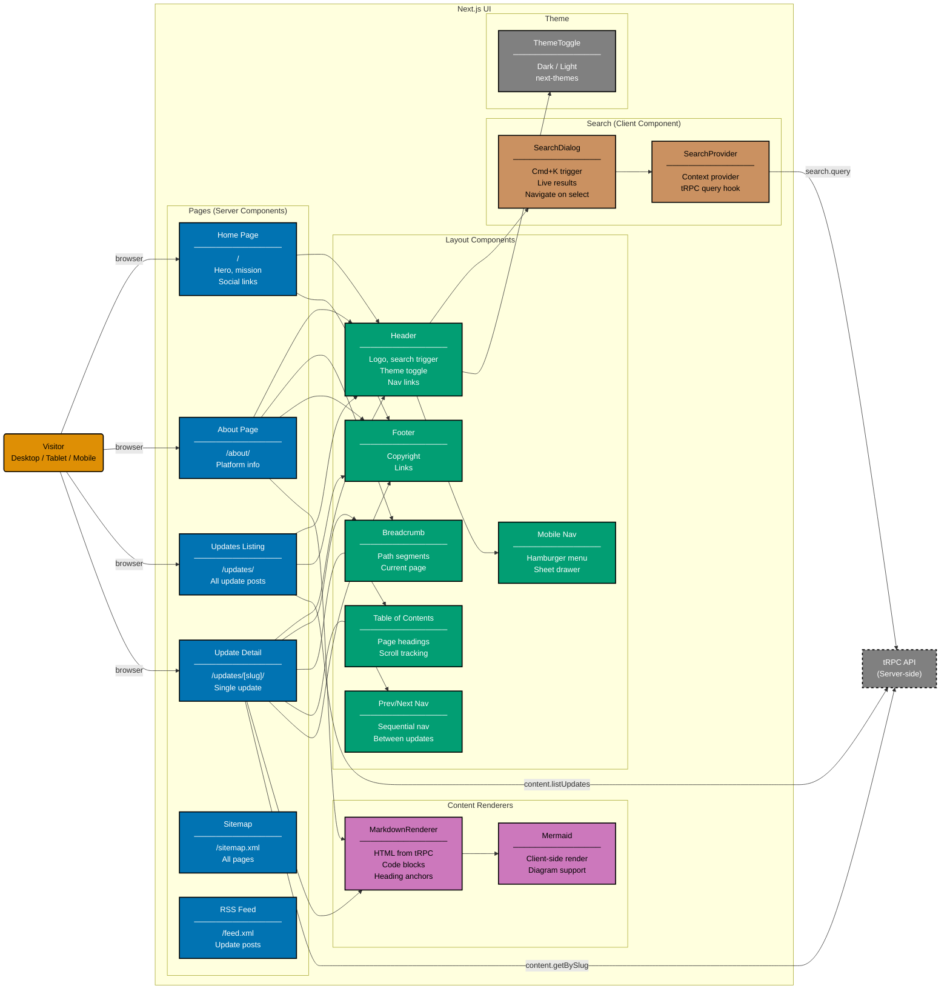

# Component Diagram: UI (Frontend)

Level 3 of the C4 model. Shows the logical components inside the Next.js client-side application:
pages, layout components, content renderers, search, and theme.

Pages are Server Components by default. Client Components are used only where browser interactivity
is needed (search dialog, theme toggle, mobile navigation, Mermaid rendering). There is no i18n
layer — the site is English only.

## Gherkin Coverage by Component

Each component above is exercised by Gherkin features from
[`specs/apps/oseplatform/fe/gherkin/`](../fe/):

| Component                      | Gherkin Domain | Scope                                  |
| ------------------------------ | -------------- | -------------------------------------- |
| Home Page (hero, social icons) | landing-page   | Hero rendering, social links           |
| Header + navigation links      | navigation     | Header links, external links           |
| Breadcrumb + Prev/Next         | navigation     | Breadcrumbs, sequential navigation     |
| ThemeToggle                    | theme          | Default theme, toggle dark/light       |
| Header + Mobile Nav            | responsive     | Hamburger menu, desktop nav visibility |

## Testing

| Level       | What                           | Coverage |
| ----------- | ------------------------------ | -------- |
| `test:unit` | Component rendering via Vitest | >= 80%   |
| `test:e2e`  | Full browser via Playwright    | N/A      |

## Related

- **Container diagram**: [container.md](./container.md)
- **Backend component diagram**: [component-be.md](./component-be.md)
- **Frontend gherkin specs**: [fe/gherkin/](../fe/)
- **Parent**: [oseplatform-web specs](../README.md)
