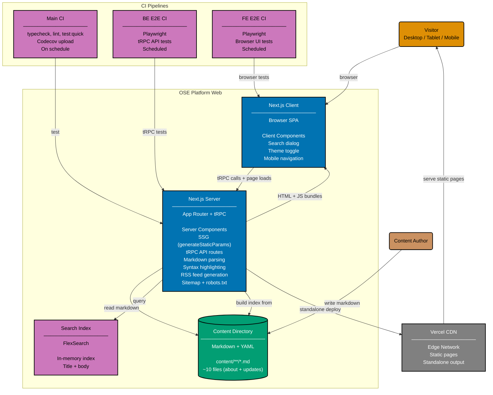

# Container Diagram: OSE Platform Web

Level 2 of the C4 model. Shows the runtime containers inside the OSE Platform Web system
boundary: the Next.js application (server + client), the content directory, the in-memory search
index, and the Vercel hosting platform.

The Next.js app runs as a standalone deployment on Vercel. Content pages are statically generated
at build time via `generateStaticParams`. The search index is built in-memory from content
metadata using FlexSearch.

## Container Details

### Next.js Server

The server-side runtime handles:

- **tRPC API** (`/api/trpc/[trpc]`): Procedures for content retrieval, search, and metadata
- **Server Components**: Pages statically generated at build time via `generateStaticParams`
- **Content pipeline**: gray-matter to unified (remark/rehype) to HTML with syntax highlighting
  (shiki)
- **Search index**: FlexSearch built from all content metadata at startup
- **RSS feed**: `/feed.xml` generated from update posts
- **SEO**: `/sitemap.xml` and `/robots.txt` for search engine crawlers

### Next.js Client

The browser-side application provides:

- **Search dialog**: Full-text search via tRPC call to server-side FlexSearch
- **Theme toggle**: Dark/light mode via next-themes
- **Mobile navigation**: Hamburger menu for small viewports
- **Content rendering**: Markdown HTML with code blocks, Mermaid diagrams

### Content Directory

- ~10 markdown files with YAML frontmatter
- About page and update posts
- Frontmatter: title, date, summary, tags, draft

## Related

- **Context diagram**: [context.md](./context.md)
- **Backend component diagram**: [component-be.md](./component-be.md)
- **Frontend component diagram**: [component-fe.md](./component-fe.md)
- **Parent**: [oseplatform-web specs](../README.md)
