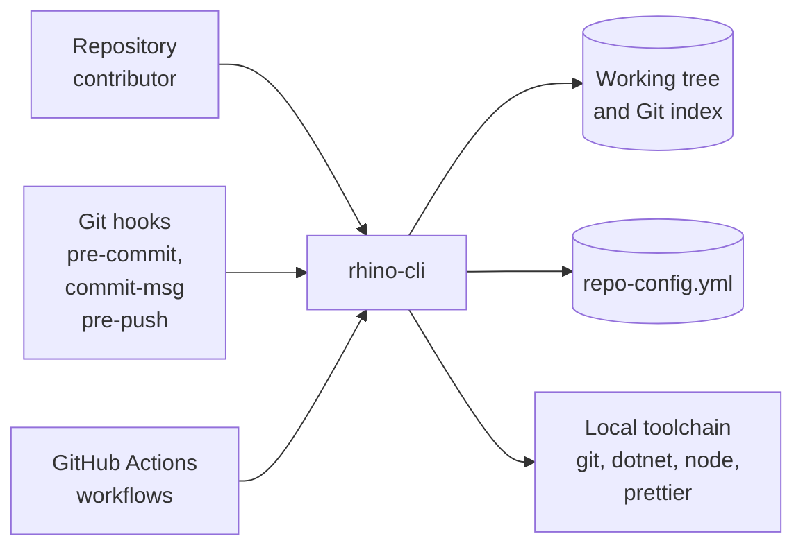
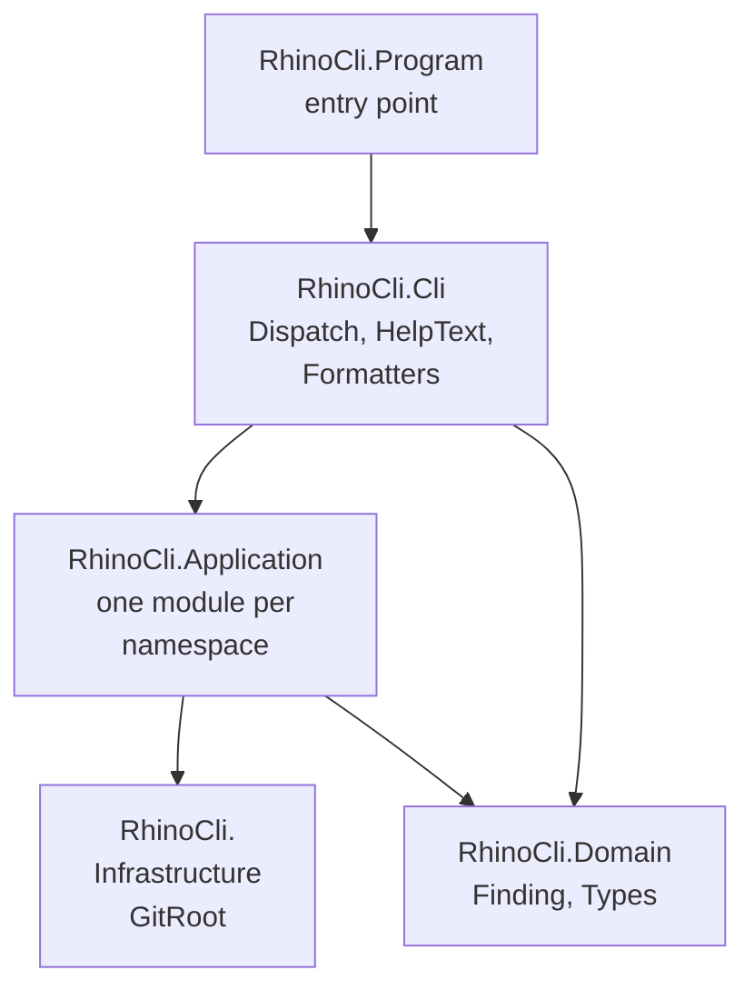

# Rhino CLI — Architecture

The current, as-built system. Nothing here describes a proposal; a change that alters an actor, a
container, a component responsibility, a relationship, or a boundary updates this document in the
same delivery unit.

## Scope

`rhino-cli` is the repository's own governance tool. It reads the working tree and
`repo-config.yml`, decides whether a declared rule holds, and reports. It never edits a tracked
file except through an explicit generator verb (`harness bindings generate`,
`parity manifest generate`, `env init`), and it never reaches the network.

## System Context

Three actors invoke the same binary with the same argv grammar: a contributor at a terminal, a Git
hook, and a CI job. There is no second entry point and no server; a rule that CI enforces is the
rule a contributor can run locally, because it is literally the same command.

`repo-config.yml` is the only registry. Harnesses, gates, environment contracts, word budgets, and
the testing contract are declared there, so adding a gate or a harness is an entry in that file
rather than a code change.

## Containers

| Container                             | What it is                                      | How it is reached                                               |
| ------------------------------------- | ----------------------------------------------- | --------------------------------------------------------------- |
| `rhino-cli-fsharp`                    | one self-contained .NET 10 executable           | published by `nx run rhino-cli:build` to `src/dist/`            |
| `apps/rhino-cli/scripts/rhino-bin.sh` | resolver shim every generated gate command uses | `RHINO_CLI_FSHARP_BIN`, then `src/dist/`, then `dotnet run`     |
| Nx targets                            | the named surfaces that invoke the binary       | `test:quick`, static `test:coverage:*`, and per-gate validation |

The shim exists so a gate invocation skips the .NET SDK's per-run startup cost once a binary is
available. It passes argv through unchanged and `exec`s, so no exit code is swallowed or remapped.
CI always sets `RHINO_CLI_FSHARP_BIN` to the artifact its build job uploaded; the `dotnet run` tier
is the local last resort and is the only tier that needs the SDK.

## Components

| Project        | Responsibility                                                                                     |
| -------------- | -------------------------------------------------------------------------------------------------- |
| Domain         | the finding record and the shared types every validator reports through                            |
| Infrastructure | locating the repository root — the only ambient input the rest of the code is allowed              |
| Application    | one module per command namespace; each is a pure function from paths and configuration to findings |
| Cli            | the argv route table, the option parsers, the help text, and the rendering of findings             |
| Program        | the entry point and the exit-code mapping                                                          |

The route table in `Dispatch.fs` is the single place a command exists. A three-segment route is
listed before its two-segment prefix, because the table is matched in order and a shorter prefix
would otherwise swallow the longer one.

## Constraints

**Argument rejection precedes work.** Every leaf rejects an unknown option and a missing required
option before it reads a file, so exit `2` always means "the invocation was wrong" and never "the
check failed".

**Findings are values.** An Application module returns a list of findings; the Cli renders them and
maps emptiness to an exit code. No module prints from inside a rule, which is what lets the unit
suite assert on the finding list rather than on captured stdout.

**Byte-identical parity.** `apps/rhino-cli/parity-manifest.sha256` names every file that must be
identical in `ose-private`. A change to any listed file opens an obligation in the other
repository; the `parity-manifest` gate proves the manifest matches the local tree, and the plan
that changed the file carries the cross-repository half.

**No network, no ambient state.** The binary reads the tree, the index, and `repo-config.yml`. It
does not fetch, and it does not depend on an environment variable other than the explicit
`RHINO_CLI_FSHARP_BIN` override and the Git variables a hook already sets.

## Markdown-Validation Constraints

Two rules inside the `md` namespace are not derivable from the code's shape and are recorded here
because a reader who changes them will silently change what the gate accepts.

**Anchor slugs follow GitHub, not a simplification.** `md links validate` resolves a `#fragment`
with a slug algorithm verified against `github-slugger` v2: lowercase; Unicode letters, digits,
underscores, hyphens, and spaces are kept; everything else is stripped; spaces become hyphens with
no collapsing; a duplicate slug gets a `-1`, `-2`, … suffix in document order. Underscores survive,
which is the detail a hand-rolled slugger usually gets wrong.

**Heading-hierarchy scanning is default-deny.** `md heading-hierarchy validate` scans only an
allowlist: `docs/`, `repo-governance/`, `plans/` minus `plans/done/`, `specs/`, root-level `*.md`,
`apps/*/README.md`, `libs/*/README.md`, `apps/*/docs/**`, and `libs/*/docs/**`. Prose written
outside that set is not measured, so moving a document out of the allowlist silently removes it
from the gate.

**Mermaid ranking survives cycles.** `md mermaid validate` removes back edges by depth-first search
before longest-path ranking, so a cyclic flowchart ranks as its underlying chain instead of
collapsing every node to rank 0.

## Related

- [Behaviours](./behaviours/README.md) — the scenarios this system must satisfy.
- [`apps/rhino-cli/README.md`](../../../../apps/rhino-cli/README.md) — the implementing project.
