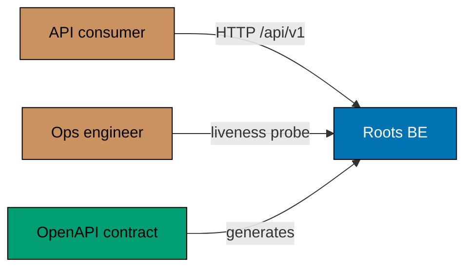
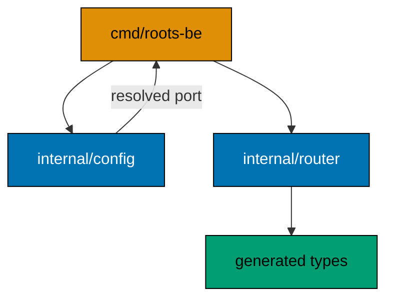

# Roots BE — Architecture

The current, as-built system. A change that alters an actor, a container, a component
responsibility, a relationship, or a boundary updates this document in the same delivery unit.

## Scope

`roots-be` serves a versioned HTTP surface for Sharia-compliance capability. Today that surface
carries one route — a liveness probe. It holds no credential, opens no outbound connection, and
persists nothing.

## System Context

The contract is drawn as an input rather than an artefact: the service does not describe itself
after the fact, it is generated from a document that exists first.

## Containers

| Container  | Technology   | Port | Persistence |
| ---------- | ------------ | ---- | ----------- |
| `roots-be` | Go 1.26, Gin | 8402 | none        |

One process, no sidecar, no broker. The service is deployable as a single container image because
it depends on nothing it does not start.

## Components

Two bounded contexts under `internal/`:

| Bounded context | Responsibility                                         |
| --------------- | ------------------------------------------------------ |
| `config`        | resolving the listener port from flag, env, or default |
| `router`        | the Gin engine and the handler set the contract binds  |

`config` is a bounded context rather than a helper because its resolution order is observable
behaviour with its own scenarios — a caller can tell which source won.

## Constraints

**Contract first.** The OpenAPI document under `contracts/` is the source; the service generates
from it with `oapi-codegen`. The router satisfies the generated `ServerInterface`, so a handler
whose shape diverges from the published specification fails to compile rather than failing in
production.

**No shared `PORT`.** The service reads `ROOTS_BE_PORT` and ignores a bare `PORT`. One exported
variable must not silently retarget every app on the machine at once.

**Nothing to protect, nothing to authenticate.** The surface is unauthenticated because it exposes
no data. The first route that returns a judgement changes this, and that is an architectural change.
