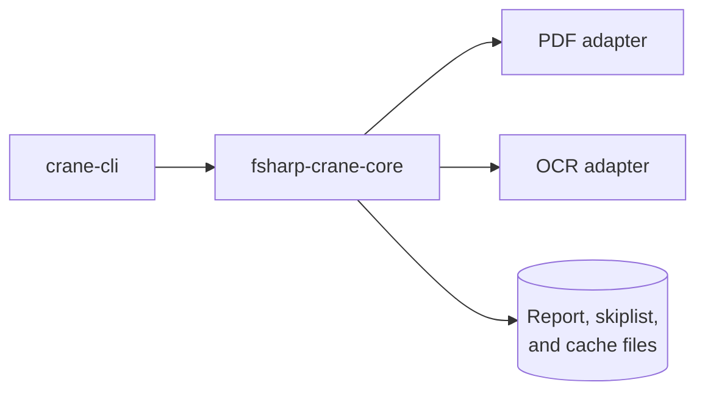

# fsharp-crane-core — Architecture

The current, as-built library. A change that alters a port, a consumer relationship, or the
extraction-path decision updates this document in the same delivery unit.

## Scope

`fsharp-crane-core` is the shared F# domain, logic, and outbound-adapter library for
PDF-to-Markdown conversion. It owns the vocabulary — `PdfMetadata`, `Finding` — the extraction-path
decision, report and skiplist persistence logic, the extraction cache, and the PDF/OCR adapters.

## Consuming Boundary

The library declares PDF and OCR ports and ships their production adapters. The CLI composition root
selects those adapters. Pure routing scenarios run against recording ports; isolated Integration
tests exercise the library's owned local-file and environment boundary.

## Components

| Module               | Responsibility                                                               |
| -------------------- | ---------------------------------------------------------------------------- |
| `Core/Ports`         | `IPdfPort`, `IOcrPort`, and the function aliases for read, write, and append |
| `Domain/PdfMetadata` | what the core knows about a document                                         |
| `Domain/Finding`     | the single shape every check reports in                                      |
| `Convert`            | the conversion walk-skeleton: sample, decide, then extract or OCR            |
| `Core/Logic`         | content checks plus injected report/skiplist logic and the extraction cache  |
| `Adapters/Out`       | production PDF extraction and OCR implementations                            |

## The Extraction-Path Decision

`convertPdfToMarkdown` samples three pages and counts words. More than ten words means the document
carries a real text layer and goes to `ExtractPages`; ten or fewer means it is effectively an image
and goes to `ExtractText` through OCR.

That threshold is a judgment, not a derived constant, and it is the library's one behavioural
decision — which is why it belongs in a scenario rather than only in the code.

## Constraints

**Every failure is a `Result`, never an exception.** Both ports return `Result<_, string>`, and the
core propagates rather than throws, so a consumer decides how a failed extraction is reported.

**Boundary classification follows the strongest real dependency.** Pure routing and checker tests
inject collaborators and run as Unit. ReportManager, SkiplistManager, and PdfExtractionCache tests
that use actual files or environment state run as Integration. The library exposes no public
process, browser, or HTTP boundary, so it owns no E2E target.

## Related

- [Behaviours](./behaviours/README.md) — the scenarios this library must satisfy.
- [`libs/fsharp-crane-core/project.json`](../../../libs/fsharp-crane-core/project.json) — the
  implementing project.
- [`specs/apps/crane/cli`](../../apps/crane/cli/README.md) — the consumer that supplies both ports.
