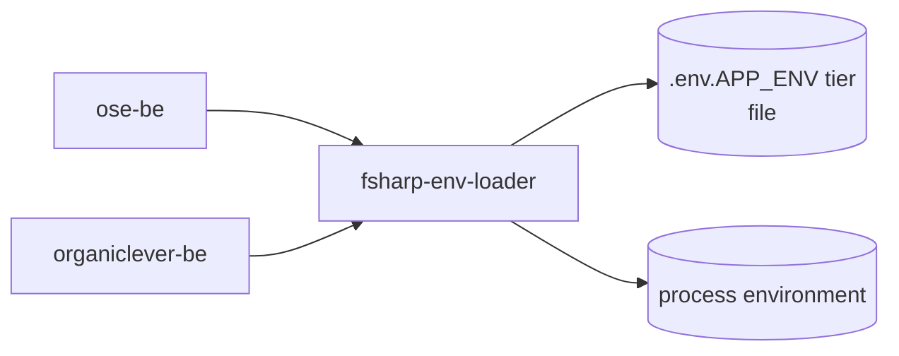

# fsharp-env-loader — Architecture

The current, as-built library. A change that alters a consumer relationship, a module
responsibility, or the load boundary updates this document in the same delivery unit.

## Scope

`fsharp-env-loader` holds this repo's `.env.<APP_ENV>` tier convention and runtime listener-port
contract for its F# backends, mirroring the sibling
[`ts-env-loader`](../ts-env-loader/README.md) package one-for-one so a TypeScript service and an F#
service resolve their tier file and their port by exactly the same rules.

## Consuming Boundary

Every consumer calls `EnvTier.loadEnvTierFrom` explicitly from its own composition root
(`Program.fs`'s `main`) — this module never loads on import. A library that auto-loaded its own
tier file would silently compete with the app's own loader, with no way for the consumer to
sequence the two.

## Components

| Module            | Responsibility                                                                            |
| ----------------- | ----------------------------------------------------------------------------------------- |
| `resolveTier`     | maps `APP_ENV` to the one tier in effect, defaulting to `local`                           |
| `loadEnvTierFrom` | searches an ordered list of directories for the first `.env.<tier>` file and applies it   |
| `PortResolver`    | resolves a listener port from `--port`, then the app's prefixed variable, then a fallback |

## Constraints

**Process environment always wins.** A variable already set in the process (a null-check only, so
an explicit empty string still counts as set) is never overwritten by a tier-file value, so a
deployment platform's injected value survives a tier file that also names it.

**A missing tier file is not an error.** Local development frequently has no file for the current
tier, and CI supplies real environment variables with no file on disk at all; the loader applies
nothing and returns.

**Only the first matching search directory is read.** `loadEnvTierFrom` walks `searchDirs` in
order and stops at the first directory holding the tier file — later directories are never
consulted once a match is found.

**A malformed port fails loudly.** A present-but-unparseable `--port` or prefixed-variable value is
a mistake, not a reason to fall back silently to the compiled-in default; an out-of-range compiled-in
fallback is itself a programming error caught the same way.

## Related

- [Behaviours](./behaviours/README.md) — the scenarios this library must satisfy.
- [`libs/fsharp-env-loader/README.md`](../../../libs/fsharp-env-loader/README.md) — the implementing
  package.
- [`specs/libs/ts-env-loader/`](../ts-env-loader/README.md) — the TypeScript twin this library
  mirrors.
