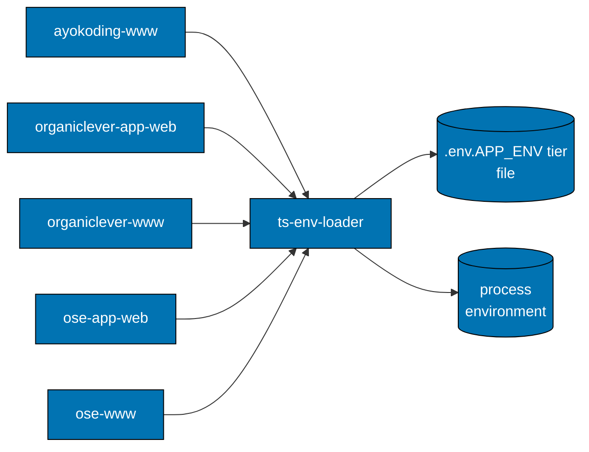

# ts-env-loader — Architecture

The current, as-built library. A change that alters a consumer relationship, a module
responsibility, or the load boundary updates this document in the same delivery unit.

## Scope

`ts-env-loader` holds the repository's `.env.<APP_ENV>` tier convention as one pure package, plus
the runtime port contract that resolves a listener port. It was extracted from six near-identical
per-app copies to close an architecture-review finding about duplication; five of those apps remain
here.

## Consuming Boundary

Every consumer calls `loadTierEnv()` explicitly from its own composition root — the first import of
`next.config.ts`. **The package never loads on import.** A library that auto-loaded its own tier
file would silently compete with the app's own loader, and the consumer would have no way to
sequence the two.

## Components

| Module            | Responsibility                                                                            |
| ----------------- | ----------------------------------------------------------------------------------------- |
| `resolveTier`     | maps `APP_ENV` to the one tier in effect                                                  |
| `tierEnvFilePath` | maps a tier to its single file path                                                       |
| `loadTierEnv`     | applies that file's values to a process-env-like record, and guards the stray-file case   |
| `port-resolver`   | resolves a listener port from `--port`, then the app's prefixed variable, then a fallback |

## Constraints

**Process environment always wins.** A variable already set in the process is never overwritten by
a file value, so a deployment platform's injected value survives a tier file that also names it.

**A missing tier file is not an error.** Local development frequently has no file for the current
tier; the loader applies nothing and returns.

**A stray auto-loaded env file beside a non-local tier file fails loudly.** Two files competing for
the same variable is a configuration mistake with no safe default, so it stops rather than picking.

**A malformed port fails loudly.** A present-but-unparseable port value is a mistake, not a reason
to fall back silently to the compiled-in default.

## Related

- [Behaviours](./behaviours/README.md) — the scenarios this library must satisfy.
- [`libs/ts-env-loader/README.md`](../../../libs/ts-env-loader/README.md) — the implementing package.
