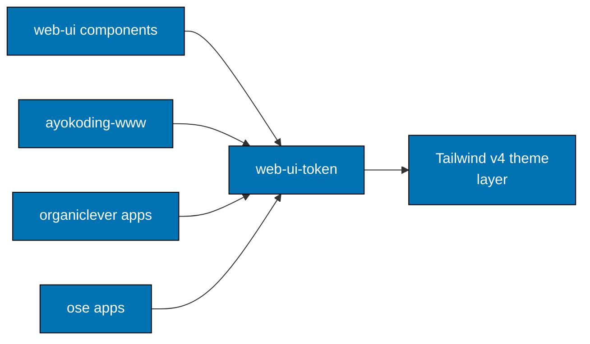

# web-ui-token — Architecture

The current, as-built library. A change that alters a consumer relationship or the
structural/brand split updates this document in the same delivery unit.

## Scope

`web-ui-token` holds the design tokens every application and `web-ui` component reads. It ships CSS
custom properties and their TypeScript counterparts; it contains no components and no behaviour
beyond exporting those values.

## Consuming Boundary

## The Structural / Brand Split

This split is the library's whole reason to exist, and getting it wrong is the failure mode worth
guarding.

| Kind           | What it covers                                                                        | Who may change it                           |
| -------------- | ------------------------------------------------------------------------------------- | ------------------------------------------- |
| **Structural** | radius scale, base neutral palette, semantic muted and destructive, dark-mode variant | the library, for everyone                   |
| **Brand**      | primary, secondary, accent, chart, and sidebar tokens                                 | each application, in its own `@theme` block |

An application overrides brand tokens in its own `globals.css` after importing `tokens.css`. It
never edits the structural set, because a structural change is a change to all five applications at
once.

Per-application sheets — `ayokoding.css`, `organiclever.css`, `ose.css` — are the recorded brand
overrides, so an application's palette is readable in one file rather than scattered through its
styles.

## Constraints

**Dark mode is a variant, not a second palette.** Tailwind v4's `@custom-variant dark` is declared
once here; an application that ships its own dark palette diverges from the others silently.

**The exported TypeScript values and the CSS must agree.** `colors.ts`, `radius.ts`, `spacing.ts`,
and `typography.ts` exist so non-CSS code can read the same numbers; a token added to one and not
the other is a defect a scenario should catch.

## Related

- [Behaviours](./behaviours/README.md) — the scenarios this library must satisfy.
- [`libs/web-ui-token/README.md`](../../../libs/web-ui-token/README.md) — the implementing package.
- [`specs/libs/web-ui`](../web-ui/README.md) — the component library that consumes these tokens.
