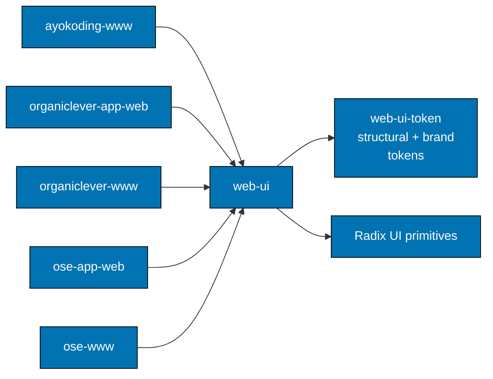

# web-ui — Architecture

The current, as-built library. A change that alters a consumer relationship, a layer boundary, or
the token dependency updates this document in the same delivery unit.

## Scope

`web-ui` is the repository's shared React component library. It owns what a component looks like,
what a user can do with it, and what accessibility contract it honors. It does not own routing,
data fetching, or application state.

## Consuming Boundary

A consuming application imports components and one brand token sheet. It never restyles a
component by overriding its class names; a visual difference between two applications comes from
the token layer, which is what keeps a single component implementation serving all five.

## Components

The library has two layers, and the split is the thing to understand before adding anything:

| Layer         | What lives there                                                                                            |
| ------------- | ----------------------------------------------------------------------------------------------------------- |
| `primitives/` | unopinionated building blocks — badge, button, card, code block, command                                    |
| `components/` | the composed, opinionated surface — dialog, sheet, side-nav, stat card, tab bar, theme toggle, and the rest |
| `types/`      | the shared prop vocabulary                                                                                  |
| `utils/`      | class composition and other cross-component helpers                                                         |

A component is built with CVA variants over Radix primitives; `asChild` composition is preferred to
a wrapper element so a consumer can render the same behaviour on its own tag.

## Constraints

**Accessibility is part of the contract, not a later pass.** A component's Gherkin scenarios assert
its role, its focus behaviour, and its `aria-invalid` handling. Removing one of those assertions is a
contract change.

**Brand differences live in tokens.** The OrganicLever surface is the same components with the warm
OKLCH palette activated by importing `web-ui-token/src/organiclever.css`. A component that hardcodes
a brand color defeats that and cannot serve the other four applications.

**Touch targets are explicit.** The OrganicLever inputs carry a 44-pixel touch target; that number
is a decision, not an accident of styling, and belongs in the scenario that asserts it.

## Related

- [Behaviours](./behaviours/README.md) — one directory per component.
- [`libs/web-ui/README.md`](../../../libs/web-ui/README.md) — the implementing package.
- [`specs/libs/web-ui-token`](../web-ui-token/README.md) — the token layer this library reads.
